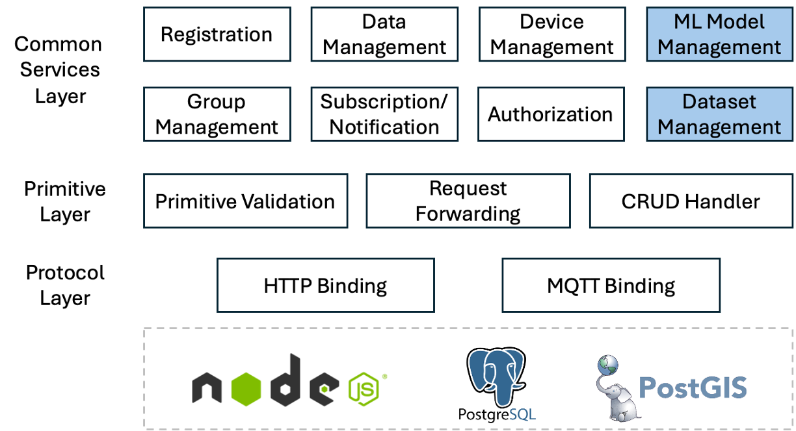

# About Mobius4

Mobius4 is the next version of [Mobius](https://github.com/iotketi/mobius) which basically implements the global IoT middleware standard, [oneM2M](https://www.oneM2M.org). This new version provides the new code base with modern Javascript async-await syntax for better readibility and maintenance. Also, the database has been changed from MySQL to PostgreSQL with PostGIS.

In oneM2M Release 5, [TR-0071](https://www.onem2m.org/technical/published-specifications/release-5) is defining candidate solutions for AIoT applications. Mobius4 implements those features in advance before the public release so developers can try them.



## Supported features

Mobius4 implements oneM2M Common Services Entity (CSE) which is the IoT middleware. By the configuration, it runs as ASN/MN-CSE as well as IN-CSE.

oneM2M protocol bindings:
- HTTP
- MQTT

oneM2M primitive serialization:
- JSON

oneM2M resource types (until Release 4):
- CSEBase, AE, remoteCSE
- accessControlPolicy
- container, contentInstance, latest, oldest
- subscription
- group, fanOutPoint

oneM2M resource types (oneM2M TR-0071, next release):
- modelRepo, mlModel, modelDeployList, modelDeployment 
- mlDatasetPolicy, dataset, datasetFragment 

Other features:
- discovery with _Filter Criteria_ parameter
- geo-query with _location_ common attribute (Rel-4 feature)
- children resources retrieval with _Result Content_ parameter

## Postman scripts

Try oneM2M APIs over HTTP binding with Postman client. You can download [Postman script collection](./docs/Mobius4.postman_collection.json) and import it on your Postman. There are two variables set in the collection `mp_url` for Mobius4 platform URL and `cb` for CSEBase resource name, so please add in your Postman variable settings. 

## How-to documents

There are some modifications from the previous version so please check 
[Mobius4 how-to](docs/how-to.md) for the Mobius developers. If you're trying the new oneM2M features on AI, check [Rel-5 features how-to](docs/rel-5-how-to.md).


# Running Mobius4

## Prerequisites

Since Mobius4 is developed with Node.js and PostgreSQL, any operating system that supports them can run Mobius4.
- Node.js v22
- PostgreSQL v17
- PostGIS
- MQTT broker (e.g. Mosquitto)

## Installation

1. Create a database named `mobius4` on PostgreSQL

2. Get Mobius4 source codes from this git repository

```bash
    git clone https://github.com/iotketi/mobius4
```

3. Install node packages in the 'mobius4' folder
```bash
    cd mobius4
    npm install
```
4. Set Mobius4 configuration file `config/default.json`

5. Run Mobius4
```bash
    node mobius4.js
```

## Configurations

You can change the following settings in the `config/default.json` configuration file.

| level 1 | level 2 | description |
| :---: | :---: | :--- |
| cse | cse_type | CSE Mode (1: IN, 2: MN, 3: ASN) |
| cse | sp_id | M2M Service Provider ID which shall start with '//' |
| cse | cse_id | CSE ID which shall start with '/'|
| cse | csebase_rn | Resource name of the CSEBase resource |
| cse | poa | Point of access of this CSE|
| cse | registrar.cse_type | CSE type of the Registrar (registration target) when this CSE registers to another CSE|
| cse | registrar.cse_id | CSE ID of the Registrar|
| cse | registrar.csebase_rn | CSEBase resource name of the Registrar |
| cse | registrar.ip | IP address of the Registrar |
| cse | registrar.port | Port number of the Registrar|
| cse | registrar.versions | Supported oneM2M versions of the Registrar |
| cse | admin | ID of the Administrator which has full privileges to any of resources|
| cse | aeid_length | String length of AE ID |
| cse | expired_resource_cleanup_interval_days | Interval of expired(obsolete) resource cleanup in days|
| cse | discovery_limit | Max number of resource IDs in the discovery response|
| cse | allow_discovery_for_any | If this is `true`, access control is ommitted for discovery operation which can reduce reponse time.|
| cse | keep_alive_timeout | HTTP session timeout in seconds |
| cb | default_acp | Default accessControlPolicy resource which is created at the initial run. This is set to the CSEBase resouce. |
| cb | default_acp.rn | Resource name of the default accessControlPolicy resource.|
| cb | default_acp.create | Allow Create privilege |
| cb | default_acp.retrieve | Allow Retrieve privilege|
| cb | default_acp.update | Allow Update privilege|
| cb | default_acp.delete | Allow Delete privilege|
| cb | default_acp.discovery | Allow Discovery privilege|
| request | max_body_size | Max HTTP body size |
| http | port | HTTP server port |
| https | port | HTTPS server port |
| mqtt | ip | MQTT broker IP address|
| mqtt | port | MQTT broker port number |
| db | host | Database address | 
| db | port | Database port number | 
| db | name | Database name: `mobius4` | 
| db | user | User name | 
| db | pw | User password |
| length | entity_id | Lenght of AE and CSE ID |
| length | ri | Length of resourceID (ri) attribute |
| length | pi | Length of parentID (pi) attribute |
| length | rn_random | Length of random string part of resourceName (rn| attribute when it is not given by Originator
| length | rn | Max length of resourceName (rn) attribute |
| length | structured_res_id | Max length of structured resource ID e.g. Mobius/cnt1|
| length | str_token | Length of each string token e.g. cnt1|
| length | url | e.g. pointOfAcess attribute|
| length | data | e.g. datasetFagment attribute|
| default | common.et_month | Default number of months for resource expiration. expiration time = current time + et_month|
| default | container.mbs | Default maxNumberOfSize of a container resource |
| default | container.mni | Default maxNumberOfInstance of a container resource|
| default | container.mia | Default maxNumberOfAge of a container resource|
| default | datasetPolicy.tcd | Default time correlation duration for a dataset creation|
| default | datasetPolicy.nvp | Default null value policy for a dataset creation |
| default | datasetPolicy.nrhd | Default number of rows in historical dataset|
| default | datasetPolicy.nrld | Default number of rows in live dataset|


## Resource browser tool

Mobius provides oneM2M resource browser tool for real-time monitoring the resource events in Mobius4. Mobius version 4 compatible resource browser can be downloaded in the "Releases" menu on this github repository (on the right handside).


When the pop up requests for ACP Originator name, put your Admin ID in your configuration (e.g. SM) to have full privileges to access all of your resources.


# Version history

## Mobius4 source code

| Version | Date | description |
| :---: | :---: | :--- |
| 4.0.0 | 2025-09-22 | Initial release of Mobius4 |

