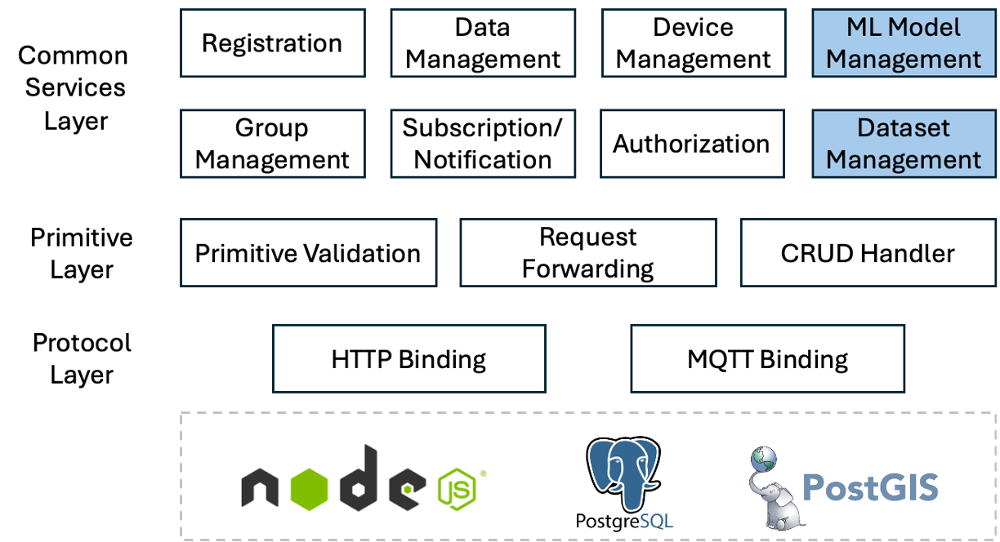

# About Mobius4

Mobius4 is the next version of [Mobius](https://github.com/iotketi/mobius) which basically implements the global IoT middleware standard, [oneM2M](https://www.oneM2M.org). This new version provides the new code base with modern Javascript async-await syntax for better readibility and maintenance. Also, the database has been changed from MySQL to PostgreSQL with PostGIS.

In oneM2M Release 5, [TR-0071](https://www.onem2m.org/technical/published-specifications/release-5) is defining candidate solutions for AIoT applications. Mobius4 implements those features in advance before the public release so developers can try them.



## oneM2M Certificate

Mobius4 is the first product to be certified as a oneM2M Release 2 compliant Common Services Entity (CSE, also known as an IoT platform). By the configuration, it runs as ASN/MN-CSE as well as IN-CSE.


## Supported oneM2M features

Mobius4 implements oneM2M Common Services Entity (CSE) which is the IoT middleware. By the configuration, it runs as ASN/MN-CSE as well as IN-CSE.

oneM2M protocol bindings:
- HTTP
- MQTT

oneM2M primitive serialization:
- JSON

oneM2M resource types (until Release 4):
- CSEBase, AE, remoteCSE
- accessControlPolicy
- container, contentInstance, latest, oldest
- flexContainer (specializations; [how to use](docs/how-to.md#flexcontainer-specializations) · [configuration](docs/configuration.md#flexcontainer-specializations))
- subscription
- group, fanOutPoint

oneM2M resource types (oneM2M TR-0071, next release):
- modelRepo, mlModel, modelDeployList, modelDeployment 
- mlDatasetPolicy, dataset, datasetFragment 

Other features:
- discovery with _Filter Criteria_ parameter
- geo-query with _location_ common attribute (Rel-4 feature)
- children resources retrieval with _Result Content_ parameter

## Platform features

Beyond the oneM2M standard, Mobius4 includes the following operational capabilities for production deployments.

Observability:
- Structured JSON logging via [Pino](https://getpino.io) with daily log rotation (`logging.*`)
- Health check endpoint `GET /health` — for load balancers and container liveness probes
- Prometheus-compatible metrics endpoint `GET /metrics` (disabled by default; enable via `metrics.enabled`)

Security:
- HTTP security headers via [Helmet](https://helmetjs.github.io) (disabled by default; enable via `security.helmet.enabled`)
- Per-IP rate limiting (disabled by default; enable via `security.rateLimit.enabled`)

Resilience:
- Graceful shutdown on `SIGTERM`/`SIGINT` — ordered teardown of HTTP, MQTT, and database connections with a 30-second forced-exit fallback
- MQTT exponential backoff reconnection — configurable initial delay, multiplier, jitter, and max attempts (`mqtt.reconnect.*`)

Operations:
- Local configuration override via `config/local.json` (gitignored) — credentials and environment-specific settings never committed
- PM2 process management via `ecosystem.config.js` — auto-restart, environment profiles, graceful stop integration

## Postman scripts

Try oneM2M APIs over HTTP binding with Postman client. You can download [Postman script collection](./docs/Mobius4.postman_collection.json) and import it on your Postman. There are two variables set in the collection `mp_url` for Mobius4 platform URL and `cb` for CSEBase resource name, so please add in your Postman variable settings. 

## How-to documents

There are some modifications from the previous version so please check 
[Mobius4 how-to](docs/how-to.md) for the Mobius developers. If you're trying the new oneM2M features on AI, check [Rel-5 features how-to](docs/rel-5-how-to.md).

For developers adding new oneM2M resource types to Mobius4: [Adding a new resource type](docs/new-resource-guide.md) — covers every file to create or modify (enums, model, DDL, CRUD handler, dispatch switches, discovery maps, validation schema) with copy-paste code patterns.

For upgrading an existing deployment: **[Upgrading Mobius4](docs/upgrading.md)** — the required steps (DB migrations, new prerequisites) and the known upgrade problems, per version. None of it applies to a clean install.


# Running Mobius4

## Prerequisites

Since Mobius4 is developed with Node.js and PostgreSQL, any operating system that supports them can run Mobius4.
- Node.js v22 or v24 — both are supported (CI runs both on every change; see [`engines`](package.json)). New installs should use v24, the current LTS and this repository's development default (see [.nvmrc](.nvmrc)); existing v22 deployments continue to work unchanged.
- PostgreSQL v17 — developed and CI-tested on 17.4.
- PostGIS v3.6 — **required, not optional.** `db/init.js` declares `GEOMETRY(GEOMETRY, 4326)` columns on the resource tables, so schema creation fails without the extension even if you never issue a geo-query. Developed on 3.6.4; CI runs the `postgis/postgis:17-3.6-alpine` image. 3.x releases below 3.6 are expected to work but are not tested here. Enable it per database with `CREATE EXTENSION postgis;`.
- MQTT broker (e.g. Mosquitto)

For OS-specific installation instructions (Windows, macOS, Linux): [docs/installation.md](docs/installation.md)

## Installation

1. Create a database named `mobius4` on PostgreSQL

2. Get Mobius4 source codes from this git repository

```bash
    git clone https://github.com/iotketi/mobius4
```

3. Install node packages in the 'mobius4' folder
```bash
    cd mobius4
    npm install
```
   If you manage Node.js versions with [nvm](https://github.com/nvm-sh/nvm), run `nvm use` inside this folder first — it picks up the version pinned in [.nvmrc](.nvmrc) (v24) automatically.

4. Set Mobius4 configuration file

```bash
cp config/local.json.example config/local.json
# edit config/local.json with your DB credentials and local settings
```

5. Run Mobius4
```bash
    node mobius4.js
```

## Configurations

Full configuration reference: [docs/configuration.md](docs/configuration.md)

For deployment details (health check, metrics endpoint, PM2, resource browser): [docs/operations.md](docs/operations.md)


# Contact

iotketi@keti.re.kr

# Version history

## Mobius4 source code

Full detail for every release is in [CHANGELOG.md](CHANGELOG.md). The **Upgrading**
column links to what an existing deployment has to *do* — required steps and known
upgrade problems. A clean install needs none of it.

| Version | Date | Description | Upgrading |
| :---: | :---: | :--- | :--- |
| 4.0.0 | 2025-09-22 | Initial release of Mobius4 | — |
| 4.1.0 | 2026-03-13 | oneM2M Rel-2 certification | — |
| 4.2.0 | 2026-04-05 | logging module update | — |
| 4.3.0 | 2026-04-09 | performance improvements | — |
| 4.4.0 | 2026-04-19 | conformance updates for performance improvements | [**DB migration required**](docs/upgrading.md#v440) |
| 4.4.1 | 2026-08-01 | Node.js 22/24 CI, dead dependency cleanup, DAS/`jose` removal, installation docs update | [Node 24 notes](docs/upgrading.md#v441) |
| 4.5.0 | 2026-08-02 | `<flexContainer>` (ty=28) with a specialization registry; response-status fallback in the HTTP binding | [**DB migration required**](docs/upgrading.md#v450) |
| 4.5.1 | 2026-08-02 | MQTT binding test coverage | [test prerequisite](docs/upgrading.md#v451) |
| 4.6.0 | 2026-08-02 | **Breaking**: `cse.admin` has no default and `SM` is refused; the administrator's privileges now come from an `<accessControlPolicy>` rather than a bypass; `resourceName` is checked against its ABNF. Closes a full access-control bypass | [**Will not start until configured; DB migration required**](docs/upgrading.md#v460) |
| 4.6.1 | 2026-08-05 | Conformance: `<CSEBase>` UPDATE/DELETE answer 4005 for every originator; the group fanout member is named `m2m:rsp` | [client-side check](docs/upgrading.md#v461) |
| 4.6.2 | 2026-08-05 | `<contentInstance>` creation and retention each become a single SQL statement — roughly 3.3× the write throughput, 2.5× with retention active; `stateTag` no longer collides under concurrent creates | — |
