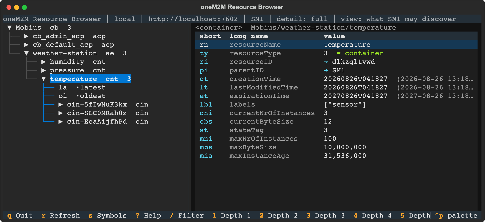

# About Mobius4

Mobius4 is the next version of [Mobius](https://github.com/iotketi/mobius) which basically implements the global IoT middleware standard, [oneM2M](https://www.oneM2M.org). This new version provides the new code base with modern Javascript async-await syntax for better readibility and maintenance. Also, the database has been changed from MySQL to PostgreSQL with PostGIS.

In oneM2M Release 5, [TR-0071](https://www.onem2m.org/technical/published-specifications/release-5) is defining candidate solutions for AIoT applications. Mobius4 implements those features in advance before the public release so developers can try them.


## oneM2M Certificate

Mobius4 is the first product to be certified as a oneM2M Release 2 compliant Common Services Entity (CSE, also known as an IoT platform). By the configuration, it runs as ASN/MN-CSE as well as IN-CSE.


## Supported oneM2M features

> Two generated files sit alongside this prose and are worth reading when the answer has to be
> precise: [`features/capabilities.json`](features/capabilities.json) records what a running
> instance actually answered (regenerated by `npm run probe-capabilities`, checked in CI), and
> [`features/support-matrix.md`](features/support-matrix.md) shows how far the implementation
> reaches across the standard, area by area.


Mobius4 implements oneM2M Common Services Entity (CSE) which is the IoT middleware. By the configuration, it runs as ASN/MN-CSE as well as IN-CSE.

oneM2M protocol bindings:
- HTTP
- MQTT — as a server, and outbound to any broker a notificationURI or a `<remoteCSE>`'s
  pointOfAccess names, not only the one this CSE listens on

oneM2M primitive serialization:
- JSON

oneM2M resource types (until Release 4):
- CSEBase, AE, remoteCSE
- accessControlPolicy
- container, contentInstance, latest, oldest
- flexContainer (specializations; [how to use](docs/how-to.md#flexcontainer-specializations) · [configuration](docs/configuration.md#flexcontainer-specializations))
- subscription
- group, fanOutPoint

oneM2M resource types (oneM2M TR-0071, next release):
- modelRepo, mlModel, modelDeployList, modelDeployment 
- mlDatasetPolicy, dataset, datasetFragment 

Other features:
- discovery with _Filter Criteria_ parameter
- geo-query with _location_ common attribute (Rel-4 feature)
- children resources retrieval with _Result Content_ parameter — nested representations
  (`rcn=4`/`rcn=8`) and child resource references (`rcn=5`/`rcn=6`), paginated with
  _Filter Criteria_ `lvl`/`lim`/`ofst`. The same four values work on DELETE, returning what was
  removed

## Platform features

Beyond the oneM2M standard, Mobius4 includes the following operational capabilities for production deployments.

Observability:
- Structured JSON logging via [Pino](https://getpino.io) with daily log rotation (`logging.*`)
- Health check endpoint `GET /health` — for load balancers and container liveness probes
- Prometheus-compatible metrics endpoint `GET /metrics` (disabled by default; enable via `metrics.enabled`)

Security:
- HTTP security headers via [Helmet](https://helmetjs.github.io) (disabled by default; enable via `security.helmet.enabled`)
- Per-IP rate limiting (disabled by default; enable via `security.rateLimit.enabled`)

Resilience:
- Graceful shutdown on `SIGTERM`/`SIGINT` — ordered teardown of HTTP, MQTT, and database connections with a 30-second forced-exit fallback
- MQTT exponential backoff reconnection — configurable initial delay, multiplier, jitter, and max attempts (`mqtt.reconnect.*`)

Operations:
- Local configuration override via `config/local.json` (gitignored) — credentials and environment-specific settings never committed
- PM2 process management via `ecosystem.config.js` — auto-restart, environment profiles, graceful stop integration

## Resource browser

A terminal tool for exploring a running Mobius4 — walk the resource tree, read attributes with
their long names decoded, and watch resources change in real time over subscriptions.



It is a **standard oneM2M client**, not a Mobius4 add-on: everything it shows comes from ordinary
RETRIEVE, discovery and subscription requests, so it works against other CSEs too. Short names are
resolved from the TS-0004 tables (`3 = container`), timestamps are rendered in your local time, and
attributes that point at other resources are marked so you can follow them.

Download a build for your OS from the [Releases](../../releases) page — **no Python needed**. See
[docs/operations.md](docs/operations.md#resource-browser-tool) for setup and the macOS note.

## Postman scripts

Try oneM2M APIs over HTTP binding with Postman client. You can download [Postman script collection](./docs/Mobius4.postman_collection.json) and import it on your Postman. There are two variables set in the collection `mp_url` for Mobius4 platform URL and `cb` for CSEBase resource name, so please add in your Postman variable settings. 

## How-to documents

There are some modifications from the previous version so please check 
[Mobius4 how-to](docs/how-to.md) for the Mobius developers. If you're trying the new oneM2M features on AI, check [Rel-5 features how-to](docs/rel-5-how-to.md).

For developers adding new oneM2M resource types to Mobius4: [Adding a new resource type](docs/new-resource-guide.md) — covers every file to create or modify (enums, model, DDL, CRUD handler, dispatch switches, discovery maps, validation schema) with copy-paste code patterns.

For upgrading an existing deployment: **[Upgrading Mobius4](docs/upgrading.md)** — the required steps (DB migrations, new prerequisites) and the known upgrade problems, per version. None of it applies to a clean install.


# Running Mobius4

## Prerequisites

Since Mobius4 is developed with Node.js and PostgreSQL, any operating system that supports them can run Mobius4.
- Node.js v22 or v24 — both are supported (CI runs both on every change; see [`engines`](package.json)). New installs should use v24, the current LTS and this repository's development default (see [.nvmrc](.nvmrc)); existing v22 deployments continue to work unchanged.
- PostgreSQL v17 — developed and CI-tested on 17.4.
- PostGIS v3.6 — **required, not optional.** `db/init.js` declares `GEOMETRY(GEOMETRY, 4326)` columns on the resource tables, so schema creation fails without the extension even if you never issue a geo-query. Developed on 3.6.4; CI runs the `postgis/postgis:17-3.6-alpine` image. 3.x releases below 3.6 are expected to work but are not tested here. Enable it per database with `CREATE EXTENSION postgis;`.
- MQTT broker (e.g. Mosquitto)

Node dependencies come with `npm install` and are not on the list above, with one worth naming:

- `fast-xml-parser` — reads specialization XSDs in `scripts/build-specializations.js`. Nothing on a
  request path uses it: that script is an operator command, run **on the host** from a checkout of
  this repository, not inside the deployment image (which contains no `scripts/`). It is listed
  under `dependencies` because this repository declares no `devDependencies` at all — see
  [docs/examples/specializations/](docs/examples/specializations/) for what the script is for.

**With Docker, there is nothing on this list to install** and no database to create by hand —
see [Installation → With Docker Compose](#with-docker-compose) below.

For OS-specific installation instructions (Windows, macOS, Linux): [docs/installation.md](docs/installation.md)

## Installation

Two ways. **Docker Compose is the shorter one** — it brings up Mobius4, PostgreSQL with PostGIS
and an MQTT broker together, so nothing on the Prerequisites list has to be installed by hand.
Install natively when you want Mobius4 running directly on the host, or already have a database
and broker to point at.

### With Docker Compose

```bash
git clone https://github.com/iotketi/mobius4
cd mobius4
cp .env.example .env
# edit .env: DB_PW and CSE_POA at least
docker compose up -d
curl localhost:7599/health
```

That is the whole install — no Node, no database, no manual `createdb`. The schema is created on
first boot.

| Service | Image | Published to the host |
| :--- | :--- | :---: |
| `mobius4` | built from this repository | 7599 (HTTP), 7580 (HTTPS, when enabled) |
| `postgres` | `postgis/postgis:17-3.5` | **no** |
| `mosquitto` | `eclipse-mosquitto:2` | **no** |

The database and the broker are reachable from the compose network and nowhere else. For a `psql`
session, use `docker compose exec postgres psql -U "$DB_USER" "$DB_NAME"`.

To upgrade later:

```bash
git pull
docker compose build
docker compose up -d
```

> **On Apple Silicon and other arm64 hosts**, the official PostGIS image is `linux/amd64` only and
> the pull fails with `no matching manifest for linux/arm64`. Set `POSTGRES_IMAGE` in `.env` to a
> multi-architecture build — `.env.example` names two.

Everything else — HTTPS, MQTT, the administrator identity, backup and restore, registering with
another CSE, and what to check before upgrading — is in **[docs/docker.md](docs/docker.md)**.

### Native install

1. Create a database named `mobius4` on PostgreSQL

2. Get Mobius4 source codes from this git repository

```bash
    git clone https://github.com/iotketi/mobius4
```

3. Install node packages in the 'mobius4' folder
```bash
    cd mobius4
    npm install
```
   If you manage Node.js versions with [nvm](https://github.com/nvm-sh/nvm), run `nvm use` inside this folder first — it picks up the version pinned in [.nvmrc](.nvmrc) (v24) automatically.

4. Set Mobius4 configuration file

```bash
cp config/local.json.example config/local.json
# edit config/local.json with your DB credentials and local settings
```

5. Run Mobius4
```bash
    node mobius4.js
```

## Configurations

Full configuration reference: [docs/configuration.md](docs/configuration.md)

For deployment details (health check, metrics endpoint, PM2, resource browser): [docs/operations.md](docs/operations.md)

To serve the HTTP binding over TLS — obtaining a certificate, installing it, replacing it before it expires, and what it does and does not prove about the client: **[docs/tls.md](docs/tls.md)**


# Contact

iotketi@keti.re.kr

# Version history

## Mobius4 source code

Full detail for every release is in [CHANGELOG.md](CHANGELOG.md). The **Upgrading**
column links to what an existing deployment has to *do* — required steps and known
upgrade problems. A clean install needs none of it.

| Version | Date | Description | Upgrading |
| :---: | :---: | :--- | :--- |
| 4.0.0 | 2025-09-22 | Initial release of Mobius4 | — |
| 4.1.0 | 2026-03-13 | oneM2M Rel-2 certification | — |
| 4.2.0 | 2026-04-05 | logging module update | — |
| 4.3.0 | 2026-04-09 | performance improvements | — |
| 4.4.0 | 2026-04-19 | conformance updates for performance improvements | [**DB migration required**](docs/upgrading.md#v440) |
| 4.4.1 | 2026-08-01 | Node.js 22/24 CI, dead dependency cleanup, DAS/`jose` removal, installation docs update | [Node 24 notes](docs/upgrading.md#v441) |
| 4.5.0 | 2026-08-02 | `<flexContainer>` (ty=28) with a specialization registry; response-status fallback in the HTTP binding | [**DB migration required**](docs/upgrading.md#v450) |
| 4.5.1 | 2026-08-02 | MQTT binding test coverage | [test prerequisite](docs/upgrading.md#v451) |
| 4.6.0 | 2026-08-02 | **Breaking**: `cse.admin` has no default and `SM` is refused; the administrator's privileges now come from an `<accessControlPolicy>` rather than a bypass; `resourceName` is checked against its ABNF. Closes a full access-control bypass | [**Will not start until configured; DB migration required**](docs/upgrading.md#v460) |
| 4.6.1 | 2026-08-05 | Conformance: `<CSEBase>` UPDATE/DELETE answer 4005 for every originator; the group fanout member is named `m2m:rsp` | [client-side check](docs/upgrading.md#v461) |
| 4.6.2 | 2026-08-05 | `<contentInstance>` creation and retention each become a single SQL statement — roughly 3.3× the write throughput, 2.5× with retention active; `stateTag` no longer collides under concurrent creates | — |
| 4.6.3 | 2026-08-05 | `db.pool.max` is the connection total for the process rather than a figure each of two pools applied separately; default 30 → 20. Unblocks running more than one instance | [only if you overrode `db.pool.max`](docs/upgrading.md#v463) |
| 4.6.4 | 2026-08-05 | A name that is already taken is refused with 4105 rather than 4000, including under concurrency; MQTT subscription and expired-resource cleanup run on one instance | — |
| 4.6.5 | 2026-08-06 | **Conformance**: a `<contentInstance>` under a `<container>` carrying an `<accessControlPolicy>` was refused to every originator, the administrator included, and was missing from discovery results — it now follows the parent's policy as `TS-0001:9.6.7` requires. Discovery decides access once per policy holder instead of once per resource: 18 → 614 requests per second over 150 content instances. Development logging settings carried into a deployment now say so at startup | [workarounds you can undo](docs/upgrading.md#v465) |
| 4.7.0 | 2026-08-07 | **HTTPS is now optional and off by default** — an existing deployment must set `https.enabled` and point `https.key`/`https.cert` at its own files to keep serving TLS. The listener no longer asks clients for certificates: it set `requestCert` but nothing ever read the certificate, so it never proved the originator. The certificates this repository shipped are deleted and must be treated as disclosed | [**Set `https.enabled` to keep TLS; reissue the shipped keys**](docs/upgrading.md#v470) |
| 4.8.0 | 2026-08-07 | `docker compose up` brings up mobius4, PostgreSQL/PostGIS and an MQTT broker in one command — see [docs/docker.md](docs/docker.md). No change for an existing source deployment | — |
| 4.9.0 | 2026-08-07 | A `<container>`'s `maxInstanceAge` now actually caps its `<contentInstance>` children's `expirationTime` (`TS-0004:7.4.7.2.1` step 2 e), and its default widens from 30 to 365 days so a default container keeps behaving as before; new `maxByteSizePerInstance` (`mbis`) refuses oversized content independently of `maxByteSize` | [**DB migration required**](docs/upgrading.md#v490) |
| 4.10.0 | 2026-08-07 | **Breaking for `rcn=4`/`rcn=8` clients**: child resources are now nested inside their own parent instead of grouped by type at the top level (`TS-0004:8.4.3` EXAMPLE 3), and `lim` cuts on subtree boundaries while `ofst` counts direct children. Both fail silently against an old client. `rcn=5`/`rcn=6` are implemented — they previously returned attributes only, with RSC 2000. Truncated child-resource results now set `X-M2M-CTS`/`X-M2M-CTO` | [**Client-side changes required**](docs/upgrading.md#v4100) |
| 4.11.0 | 2026-08-08 | **`contentSize` now counts bytes** (`TS-0001:9.6.7`) instead of JavaScript string units — a 10-byte payload was being refused by a `maxByteSizePerInstance` of 10, and `cbs`/`mbs`/`sizeAbove`/`sizeBelow` read the same figure. A database failure answers **5000 instead of 4004/4000/4103**, so a client retries rather than trying to recreate live resources. `/health` became a readiness check and now fails when the database is unreachable. `<subscription>` sets `creator` and notifications carry it (`TS-0004:7.4.8.2.1`, `7.5.1.2.2`); `creator` can no longer name another entity | [**Read before upgrading — `contentSize` values change**](docs/upgrading.md#v4110) |
| 4.11.1 | 2026-08-08 | Forwarding to a `<remoteCSE>` kept the remote CSE's response status instead of replacing it with `2000`, and now tries every `pointOfAccess` before answering **5103 TARGET_NOT_REACHABLE**; an `mqtt:` access point is refused rather than reported as success. A generated `resourceName` is checked for collision before use. `<AE>` mandatory-attribute validation moved into the Joi schema. Dead module `cse/routing.js` removed | — |
| 4.12.0 | 2026-08-08 | **DELETE honours `rcn` 4/5/6/8** (`TS-0001:8.1.2` Table 8.1.2-1) — the response can now carry the child resources, or references to them, as they were just before removal. **Notifications go to the broker their `mqtt://` URL names** instead of always to this CSE's own (`TS-0010:6.6.2`/`6.6.4`), and a `<remoteCSE>` whose `pointOfAccess` is `mqtt://` can now be forwarded to (`TS-0010:6.4.2`/`6.4.3`). All additive | — |
| 4.13.0 | 2026-08-08 | **Group members hosted on another CSE now work.** A member the CSE did not host resolved to resource type 0, was dropped by the default consistency strategy, and the group was still returned with `memberTypeValidated` = true — it now retrieves the member's type from its Hosting CSE and distinguishes readable / no-privilege / unreachable as `TS-0004:7.4.13.2.1` requires. `<AE>` accepts `ontologyRef`, and an `<AE>` UPDATE no longer discards `contentSerialization`. A fanout over a group with no members answers **4109 NO_MEMBERS** instead of 2000 with an empty list. Forwarded responses carry the Response Status Code as a number, not a string. Conformance tests are now transcribed from TS-0018 test purposes (209 → 282) | [**DB migration required**](docs/upgrading.md#v4130) |
| 4.13.1 | 2026-08-08 | A containerised CSE could not be told to register with another CSE: `docker/entrypoint.js` assembled `NODE_CONFIG` without a `cse.registrar` block and without `cse_type`, and it overwrites `NODE_CONFIG`, so the settings could not be injected from outside either. Six optional variables added, plus a working two-CSE compose example. No change for a standalone deployment | — |
| 4.14.0 | 2026-08-11 | **Expired resources stop acting like live ones before the sweep deletes them**: an expired `<subscription>` no longer publishes notifications, and an obsolete `<contentInstance>` is no longer served by `<latest>`/`<oldest>` or listed among `rcn=4`/`rcn=8` children (`TS-0001:10.2.4.4`) — which also means `maxInstanceAge` is now enforced on reads, not only on writes. The sweep runs at startup, so a deployment restarting more often than its interval no longer skips it entirely. **Breaking if you compute `ofst` yourself**: the offset filter is 1-based, so `ofst=1` is the first result rather than the second (`TS-0004:7.3.3.17.15`); `X-M2M-CTO` moves with it and is no longer ever `0`. Internal error text no longer reaches clients in `m2m:dbg` | [**Only if you compute `ofst`**](docs/upgrading.md#v4140) |
| 4.15.0 | 2026-08-15 | **The administrator bypasses access control again.** `cse.admin` is granted every operation before any `<accessControlPolicy>` is read, reversing the v4.6.0 change above: a resource created with no `accessControlPolicyIDs` is governed by its creator, which left the administrator unable to reach it *and* unable to attach a policy to it — no request could undo the state. Deliberately non-conformant; `cse.admin` must be treated as a credential. Five of the seven AI/ML resource types were unusable past CREATE and now work; `<mlModel>` stores decoded bytes, so `mlModelSize` stops over-reporting by a third | [**DB migration required**](docs/upgrading.md#v4150) |
| 4.15.1 | 2026-08-15 | Discovery and `rcn=4`/`rcn=8` return child resources **newest first**, in an order that no longer changes between identical requests. oneM2M specifies no order (`TS-0001:8.1.2`), and the old oldest-first sequence was a side effect of a query with no `ORDER BY` — which also meant `ofst` paging could skip or repeat a resource | [only if you relied on oldest-first](docs/upgrading.md#v4151) |
| 4.16.0 | 2026-08-16 | **`<timeSeries>` (ty=29) and `<timeSeriesInstance>` (ty=30)**: CRUD, retention (`maxNrOfInstances`/`maxByteSize`/`maxInstanceAge`), the mandatory `<latest>`/`<oldest>` children, and `dataGenerationTime` unique within a parent. Missing-data detection records absent data points into `missingDataList` (`TS-0001:10.2.4.29`) — a periodic sweep, since a gap is the absence of a request. **Not yet**: the `missingData` subscription condition and `notificationEventType=8`, so nothing is notified when a point goes missing | [**DB migration required**](docs/upgrading.md#v4160) |
| 4.16.1 | 2026-08-19 | The `cr` (creator) discovery filter answered 5000 instead of narrowing by creator — it now filters on the `cr` column (`TS-0004:7.3.3.17`). No change for a deployment that does not use the `cr` filter | — |
| 4.16.2 | 2026-08-24 | `<latest>`, `<oldest>` and `<fanOutPoint>` could not be reached under a parent whose `resourceName` starts with `la`, `ol` or `fopt` — a container named `lamp` answered 404 for `lamp/la`. The virtual resource name is now matched as a whole path segment. No change for a deployment whose resource names do not begin with those three | — |
| 4.17.0 | 2026-08-26 | The **MQTT registration topic** `TS-0010:6.4.4` defines (`/oneM2M/reg_req` and `/oneM2M/reg_resp`) is now served — an Originator that does not yet know its AE-ID can register there, where before the CSE did not subscribe and sent no answer at all. It accepts `<AE>` and `<remoteCSE>` creation only, and it authenticates nothing: the Credential-ID segment is an opaque string. Registration over the ordinary `/oneM2M/req` topic is unchanged | [nothing required, but read the caveat](docs/upgrading.md#v4170) |
| 4.17.1 | 2026-08-27 | Six answers the CSE did not mean. An unimplemented resource type says **5001 NOT_IMPLEMENTED** rather than 5000, which meant "the server broke"; a `<container>`'s `mni`/`mbs`/`mia`/`acpi`/`lbl`/`loc` **can now be cleared with `null`** as oneM2M intends, having been refused 4000; MQTT `xml`/`cbor` requests are refused instead of vanishing; and a CSE-created `<dataset>` notifies subscribers as `<datasetFragment>` already did. **Breaking for anyone creating `<dataset>`/`<datasetFragment>` directly** — `TR-0071` defines no such API and it is now refused | [**only if you create datasets directly**](docs/upgrading.md#v4171) |
